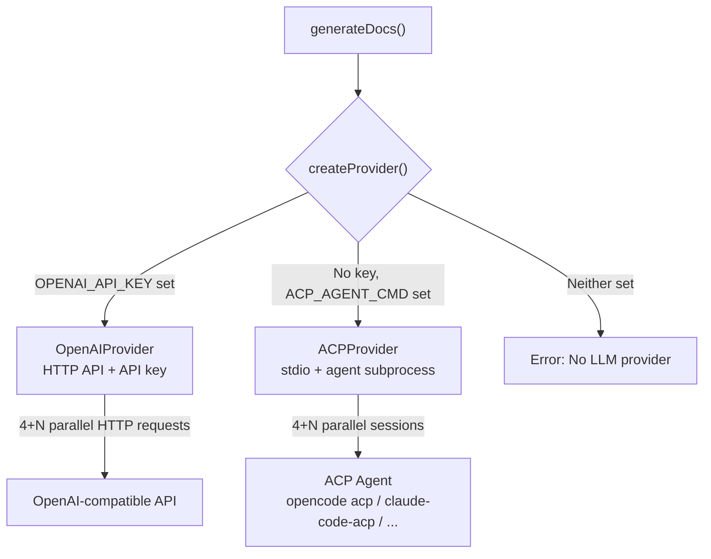

# java-openspec

[中文文档](README.zh-CN.md)

A CLI tool that auto-generates OpenSpec stores from Java Spring Cloud projects.

## Features

- Auto-detect Spring Boot microservice modules from Maven multi-module projects
- Extract project structure, naming conventions, and code patterns via CodeGraph AST analysis
- Generate spec documents using LLM (overview, coding-style, architecture, security)
- Generate C4 architecture diagrams + sequence diagrams using Mermaid
- Output as OpenSpec 1.5.0 store with automatic registration

## Prerequisites

| Tool | Min Version | Purpose | Check Command |
|------|-------------|---------|---------------|
| [Bun](https://bun.sh) | 1.3 | Runtime | `bun --version` |
| [CodeGraph](https://github.com/colbymchenry/codegraph) | 1.4 | Java AST analysis | `codegraph --version` |
| [OpenSpec](https://github.com/Fission-AI/OpenSpec) | 1.6 | Store creation & registration | `openspec --version` |

### Install CodeGraph

```bash
# After installation, run codegraph init on the target project to build the index
codegraph --version
```

### Install OpenSpec

```bash
npm install -g @fission-ai/openspec@latest
openspec --version
```

## Installation

```bash
# Install via npm
npm install -g java-openspec

# Or install via Bun
bun add -g java-openspec

# Verify
java-openspec --version
```

## LLM Configuration

`.env` file is searched in priority order:

1. `$JAVA_OPENSPEC_ENV` - Explicit path
2. `$PWD/.env` - Current working directory
3. `~/.config/java-openspec/.env` - XDG global config

```bash
# Global config (recommended)
mkdir -p ~/.config/java-openspec
cp .env.example ~/.config/java-openspec/.env
# Edit ~/.config/java-openspec/.env with your API key
```

Two LLM backends are supported:

### OpenAI Mode (default)

Uses OpenAI API format, compatible with any OpenAI-compatible service. Requires `OPENAI_API_KEY`.

```bash
# .env example - OpenAI
OPENAI_API_KEY=sk-xxx
LLM_MODEL=gpt-4o-mini
LLM_BASE_URL=https://api.openai.com/v1

# .env example - Volcengine Ark
# OPENAI_API_KEY=your-ark-key
# LLM_MODEL=deepseek-v4-flash
# LLM_BASE_URL=https://ark.cn-beijing.volces.com/api/coding/v3
```

### ACP Mode (no API key needed)

When `OPENAI_API_KEY` is not set, java-openspec can connect to an existing AI agent via [ACP (Agent Client Protocol)](https://agentclientprotocol.com). The agent handles LLM calls with its own credentials.

```bash
# .env example - ACP mode
# Recommended: opencode acp (if opencode is installed)
ACP_AGENT_CMD=opencode acp

# Other compatible agents:
# ACP_AGENT_CMD=claude-code-acp
# ACP_AGENT_CMD=gemini --experimental-acp
```

ACP mode behavior:
- **Permission control**: Agent can read files (`fs/read_text_file`) but cannot write files or run terminal commands
- **Token report**: Shows `N/A (ACP mode)` since token usage is not always reported by the agent
- **Concurrency**: Uses multi-session parallelism (one agent process, multiple ACP sessions)

## LLM Provider Architecture



The provider abstraction (`src/providers/`) decouples LLM calls from the pipeline. `generate-docs.ts` calls `createProvider()` which selects the backend based on environment variables. The pipeline and all other modules remain unchanged.

## Usage

### Single Project Mode

```bash
java-openspec init /path/to/mall-swarm
```

### Multi-Path Mode

When microservices are spread across different directories, use a config file:

```yaml
# java-openspec.yml
name: mall-specs             # optional, store name (default: workspace-specs)
exclude:                     # optional, modules to skip (exact name match)
  - mall-demo
services:
  mall-admin: /home/liyf/gitrepo/mall-admin
  mall-portal: /home/liyf/gitrepo/mall-portal
  mall-common: /home/liyf/gitrepo/mall-common
```

```bash
# project-path is optional with --config (defaults to current directory)
java-openspec init --config java-openspec.yml

# Or specify output directory explicitly
java-openspec init --config java-openspec.yml --output /path/to/store
```

## Output

```
<project>-specs/
├── .openspec-store/
│   └── store.yaml               # Store metadata + remote URL
└── openspec/
    ├── config.yaml              # Auto-filled context + rules for AI tools
    ├── specs/                   # OpenSpec requirement specs (no LLM)
    │   ├── coding-conventions/spec.md
    │   ├── service-architecture/spec.md
    │   └── security-patterns/spec.md
    └── docs/
        ├── overview.md           # Global project overview (+ cross-refs)
        ├── coding-style.md       # Global coding conventions
        ├── architecture.md       # Global architecture spec
        ├── security.md           # Global security spec
        ├── business-domains.md   # Business domain mapping (no LLM)
        ├── diagrams/
        │   ├── context.mmd               # C4 System Context
        │   ├── data-flow.mmd             # Data flow diagram
        │   ├── <service>-container.mmd   # C4 Container
        │   └── <service>-flow.mmd        # Business sequence diagram
        └── <service>/
            ├── architecture.md
            ├── business-domains.md       # Per-service business domain overview
            └── api-contracts.md          # Per-service API endpoints + Feign clients
```

## Pipeline

```
detect -> analyze -> generate-diagrams -> generate-docs -> create-store -> validate
```

1. **detect** - Scan pom.xml, identify microservice modules vs library modules
2. **analyze** - CodeGraph index + file scan, extract naming patterns, call paths, security patterns
3. **generate-diagrams** - Mermaid flowchart/sequenceDiagram generation
4. **generate-docs** - LLM generates spec documents from analysis + templates
5. **create-store** - Call openspec CLI to create store and register
6. **validate** - openspec store doctor validation

## Project Structure

```
src/
├── index.ts              # CLI entry point
├── pipeline.ts           # Main pipeline orchestration
├── detect.ts             # Maven project detection
├── analyze.ts            # CodeGraph analysis
├── generate-diagrams.ts  # Mermaid diagram generation
├── generate-docs.ts      # LLM document generation
├── providers/            # LLM provider abstraction
│   ├── index.ts          # createProvider() selection logic
│   ├── openai-provider.ts # OpenAI backend
│   └── acp-provider.ts   # ACP (Agent Client Protocol) backend
├── create-store.ts       # OpenSpec store creation
├── postprocess.ts        # LLM output post-processing
├── env.ts                # .env loading
├── pricing.ts            # Token cost estimation
└── types.ts              # Type definitions
templates/                # LLM prompt templates
spec-templates/           # Spec structure validation schemas
test/                     # Unit tests
```

## Tech Stack

- **Runtime**: Bun + TypeScript
- **LLM**: OpenAI-compatible API or ACP (Agent Client Protocol)
- **Analysis**: CodeGraph + file scanning
- **Diagrams**: Mermaid (flowchart + sequenceDiagram)
- **Validation**: unified + remark-parse (Markdown AST)
- **Config**: YAML (js-yaml)

## License

Apache-2.0