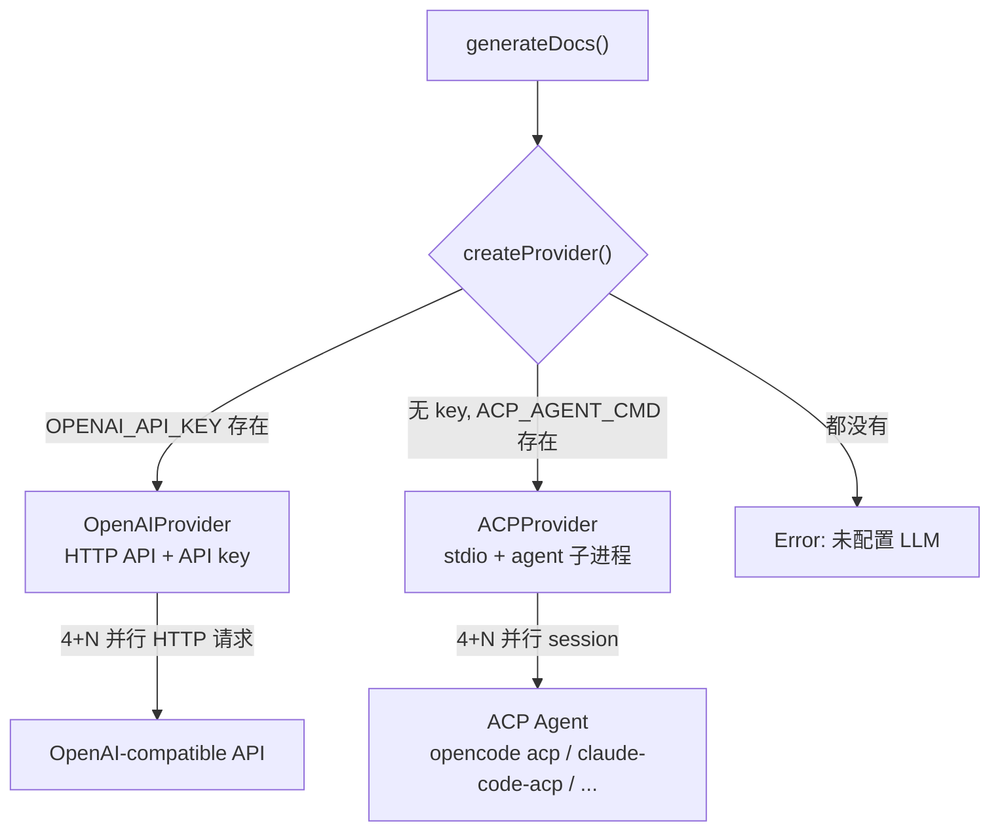

# java-openspec

[English](README.md)

从 Java Spring Cloud 项目自动生成 OpenSpec store 的 CLI 工具。

## 功能

- 自动检测 Maven 多模块项目中的 Spring Boot 微服务模块
- 基于 CodeGraph AST 分析提取项目结构、命名规范、代码模式
- 使用 LLM 生成规范文档（项目总览、编码规范、架构规范、安全规范）
- 使用 Mermaid 生成 C4 架构图 + 业务时序图
- 输出为 OpenSpec 1.5.0 store，自动注册

## 前置条件

| 工具 | 最低版本 | 用途 | 检查命令 |
|------|---------|------|---------|
| [Bun](https://bun.sh) | 1.3 | 运行时 | `bun --version` |
| [CodeGraph](https://github.com/colbymchenry/codegraph) | 1.4 | Java AST 分析 | `codegraph --version` |
| [OpenSpec](https://github.com/Fission-AI/OpenSpec) | 1.6 | Store 创建与注册 | `openspec --version` |

### 安装 CodeGraph

```bash
# 安装后需对目标项目执行 codegraph init 建立索引
codegraph --version
```

### 安装 OpenSpec

```bash
npm install -g @fission-ai/openspec@latest
openspec --version
```

## 安装

```bash
# 通过 npm 安装
npm install -g java-openspec

# 或通过 Bun 安装
bun add -g java-openspec

# 验证
java-openspec --version
```

## 配置 LLM

`.env` 文件按以下优先级查找：

1. `$JAVA_OPENSPEC_ENV` - 显式指定路径
2. `$PWD/.env` - 当前工作目录
3. `~/.config/java-openspec/.env` - XDG 全局配置

```bash
# 全局配置 (推荐)
mkdir -p ~/.config/java-openspec
cp .env.example ~/.config/java-openspec/.env
# 编辑 ~/.config/java-openspec/.env，填入 API Key
```

支持两种 LLM 后端：

### OpenAI 模式（默认）

使用 OpenAI API 格式，兼容任何 OpenAI-compatible 服务。需要 `OPENAI_API_KEY`。

```bash
# .env 示例 - OpenAI
OPENAI_API_KEY=sk-xxx
LLM_MODEL=gpt-4o-mini
LLM_BASE_URL=https://api.openai.com/v1

# .env 示例 - 火山引擎 Ark
# OPENAI_API_KEY=your-ark-key
# LLM_MODEL=deepseek-v4-flash
# LLM_BASE_URL=https://ark.cn-beijing.volces.com/api/coding/v3
```

### ACP 模式（无需 API key）

当 `OPENAI_API_KEY` 未设置时，java-openspec 可通过 [ACP (Agent Client Protocol)](https://agentclientprotocol.com) 连接已有的 AI agent。agent 使用自己的 LLM 凭证处理调用，无需额外 API key。

```bash
# .env 示例 - ACP 模式
# 首推：opencode acp（需已安装 opencode）
ACP_AGENT_CMD=opencode acp

# 其他兼容 agent：
# ACP_AGENT_CMD=claude-code-acp
# ACP_AGENT_CMD=gemini --experimental-acp
```

ACP 模式行为：
- **权限控制**：agent 可以读文件（`fs/read_text_file`），但不能写文件或执行终端命令
- **Token 报告**：显示 `N/A (ACP mode)`，因为 agent 不一定返回 token 用量
- **并发**：使用多 session 并行（一个 agent 进程，多个 ACP session）

## LLM Provider 架构



Provider 抽象层（`src/providers/`）将 LLM 调用与 pipeline 解耦。`generate-docs.ts` 调用 `createProvider()` 根据环境变量选择后端，pipeline 和其他模块完全不变。

## 用法

### 单项目模式

```bash
java-openspec init /path/to/mall-swarm
```

### 多路径模式

不同微服务分布在不同目录时，使用配置文件：

```yaml
# java-openspec.yml
name: mall-specs             # 可选，store 名称（默认: workspace-specs）
exclude:                     # 可选，要跳过的模块（精确名称匹配）
  - mall-demo
services:
  mall-admin: /home/liyf/gitrepo/mall-admin
  mall-portal: /home/liyf/gitrepo/mall-portal
  mall-common: /home/liyf/gitrepo/mall-common
```

```bash
# 与 --config 配合时 project-path 可省略（默认为当前目录）
java-openspec init --config java-openspec.yml

# 或显式指定输出目录
java-openspec init --config java-openspec.yml --output /path/to/store
```

## 输出

```
<project>-specs/
├── store.yaml
└── openspec/
    └── specs/
        ├── overview.md           # 全局项目总览
        ├── coding-style.md       # 全局编码规范
        ├── architecture.md       # 全局架构规范
        ├── security.md           # 全局安全规范
        ├── diagrams/
        │   ├── context.mmd               # C4 System Context
        │   ├── <service>-container.mmd   # C4 Container
        │   └── <service>-flow.mmd        # 业务时序图
        └── <service>/
            ├── overview.md
            └── architecture.md
```

## 工作流程

```
detect → analyze → generate-diagrams → generate-docs → create-store → validate
```

1. **detect** — 扫描 pom.xml，识别微服务模块与公共库模块
2. **analyze** — CodeGraph 索引 + 文件扫描，提取命名模式、调用路径、安全模式
3. **generate-diagrams** — Mermaid flowchart/sequenceDiagram 生成架构图
4. **generate-docs** — LLM 根据分析结果 + 模板生成 spec 文档
5. **create-store** — 调用 openspec CLI 创建 store 并注册
6. **validate** — openspec store doctor 校验输出

## 项目结构

```
src/
├── index.ts              # CLI 入口
├── pipeline.ts           # 主流程编排
├── detect.ts             # Maven 项目检测
├── analyze.ts            # CodeGraph 分析
├── generate-diagrams.ts  # Mermaid 图表生成
├── generate-docs.ts      # LLM 文档生成
├── providers/            # LLM provider 抽象层
│   ├── index.ts          # createProvider() 选择逻辑
│   ├── openai-provider.ts # OpenAI 后端
│   └── acp-provider.ts   # ACP (Agent Client Protocol) 后端
├── create-store.ts       # OpenSpec store 创建
├── postprocess.ts        # LLM 输出后处理
├── env.ts                # .env 加载
├── pricing.ts            # Token 费用估算
└── types.ts              # 类型定义
templates/                # LLM prompt 模板
spec-templates/           # Spec 结构校验 schema
test/                     # 单元测试
```

## 技术栈

- **运行时**: Bun + TypeScript
- **LLM**: OpenAI-compatible API 或 ACP (Agent Client Protocol)
- **分析**: CodeGraph + 文件扫描
- **图表**: Mermaid (flowchart + sequenceDiagram)
- **文档校验**: unified + remark-parse (Markdown AST)
- **配置**: YAML (js-yaml)